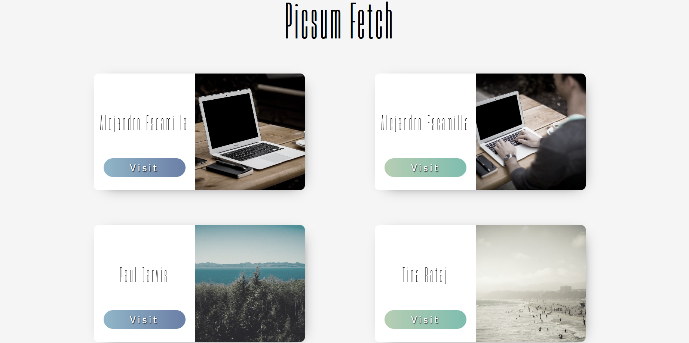

# Exercice fetch sur picsum.photos

Vous pouvez consulter le rendu [ici](https://rubenavone.github.io/picsumFetch/public)

picsum.photos vous permet de récupérer des photos par lot.  
La première étape de l'exercice sera de vous rendre sur le site.  
Lisez la page attentivement pour en comprendre le fonctionnement.  
Dans cet exercice, vous utiliserez fetch pour remplir votre site de carte.  

- Lancer insomnia, et faite des tests sur l'api 
- Regarder bien votre URL, et pour vos tests ne charger pas toutes les images (quatre ou cinq pas plus).
- Créez les fichiers/dossiers de votre projet, vous le nommerez picsumFetch
    - initialisé un repository git localement/en ligne
- Maintenant, vous êtes prêt à démarrer votre projet
    - La première étape est de récupérer vos données avec fetch
    - une fois récupérer vous allez créer votre base en 'dur' pour avoir une image du rendu
    - Maintenant, vous allez générer une 'carte' pour chaque image dans votre liste récupérer avec fetch.
        - Votre carte doit contenir les informations suivantes, le nom du photographe, la photo et un bouton avec écrit 'visit' qui renvoie vers la photo sur unsplash.
    - Si vous observez attentivement le lien des image vous allez vous rendrez compte que l'image est grande, ce qui va rendre votre chargement lent.
    Trouvez une solution pour qu'elles fassent du 600px par 600px au chargement pas avec du CSS.
    picsum permet le redimensionnement par URL photo/1920/1080
- Le Bonus Design
    - Réalisez le design tel qu'il est présenté
    - Ajoutez des animations au survol, sur mon exemple il y a une animation sur l'image qui zoom quand vous survoler l'article, et sur le bouton également.
- liste pour le design
    - la police : Heading Now sur dafont
    - les couleurs :
        - le bleu : #4f81e3
        - le bleu clair : #63c0ed
        - le vert : #36d2b0
        - le vert clair : #9cd996
- Le Bonus Technique
    - Changez le lien qui mène vers unsplash remplacez le par un lien qui emmène vers une nouvelle
    page.  
    Cette page n'a pas besoin de faire une requête, si vous transférez l'id de votre image il vous suffira de faire une carte grand format avec l'image le nom de l'auteur et l'url unsplash.
    Il est possible de faire passer ces informations de plusieurs manière, URL ou localStorage.  
    prévoyez un lien de retour à la page d'accueil.

Voilà vous avez fait un petit site qui récupère dynamiquement des images sur picsum.photos.  
Si par la suite, vous créée une petite api en php, la méthodologie sera relativement similaire (bien que chaque projet soit unique).

### Merci à picsum.photo et unsplash de fournir ce genre d'outils fort utile.
